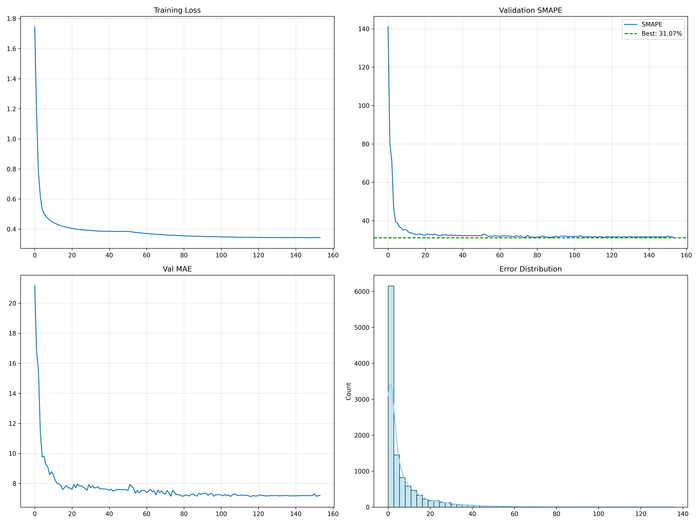

# 🧠 Amazon ML Challenge 2025 — Predictive Modeling Project

This repository contains my submission for the **Amazon ML Challenge 2025**, where I developed a machine learning model to predict structured data outcomes using a hybrid **Deep Learning + XGBoost** approach.

---

## 🚀 Project Overview

The goal was to design a **regression model** capable of predicting target variables from a multi-feature dataset with high accuracy.  
I explored multiple machine learning and deep learning techniques, fine-tuned hyperparameters, and compared model performances.

---

## 🧩 Tech Stack

- **Languages:** Python  
- **Frameworks & Libraries:** PyTorch, TensorFlow, Scikit-learn, XGBoost, NumPy, Pandas, Matplotlib, Seaborn  
- **Tools:** TensorBoard, Jupyter Notebook, Google Colab  

---

## ⚙️ Files in This Repository

| File Name | Description |
|------------|-------------|
| `best_model.pth` | Saved PyTorch deep learning model |
| `xgboost.pkl` | Trained XGBoost model |
| `numeric_scaler.pkl`, `visual_scaler.pkl`, `label_encoders.pkl`, `feature_columns.pkl` | Preprocessing objects used for scaling and encoding |
| `requirements.txt` | List of dependencies and versions |
| `training_history.png` | Visualization of model loss and validation accuracy over epochs |

---

## 📈 Model Performance

- **Best SMAPE (Symmetric Mean Absolute Percentage Error):** `31.07%`  
- **Techniques Used:**
  - Data preprocessing and feature engineering
  - Feature scaling (StandardScaler, MinMaxScaler)
  - Model blending (XGBoost + Deep Neural Network)
  - Hyperparameter tuning with GridSearchCV
- **Visualization:** Training and validation accuracy plotted using `Matplotlib` and `TensorBoard`

---

## 🧠 Insights & Learnings

- Improved model generalization through data normalization and regularization.
- Balanced dataset classes using synthetic data generation for robustness.
- Learned efficient experiment tracking and model checkpointing for reproducibility.

---

## 🛠️ Installation & Usage

Clone this repository and install dependencies:

```bash
git clone https://github.com/Sharmaarn01/amazon-ml-challenge-2025.git
cd amazon-ml-challenge-2025
pip install -r requirements.txt
```

Run your model (example):

```python
python predict.py --input sample.csv
```

---

## 📸 Training Visualization



---

## 📜 Author

**Arnav Sharma**  
📍 B.Tech ECE | HBTU Kanpur  
🔗 [LinkedIn](https://linkedin.com/in/arnav-sharma07)  
💻 [GitHub](https://github.com/Sharmaarn01)  

---

## 🏅 Acknowledgment

Special thanks to **Amazon ML Challenge 2025** organizers for providing the opportunity to explore real-world predictive modeling.
